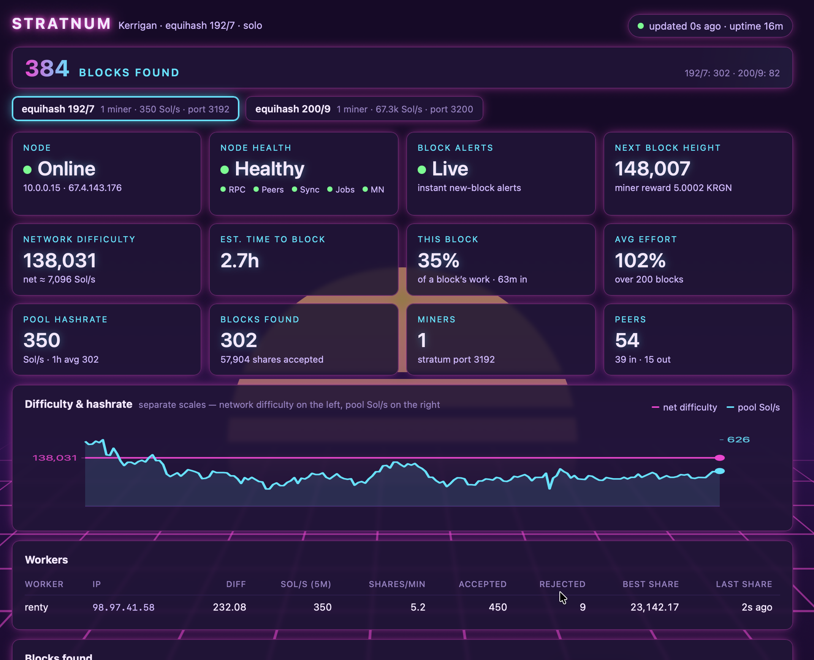

# KRGN stratnum

Solo stratum mining server + customizable themed (80s themes, thats right) dashboard using ZMQ for **Kerrigan (KRGN)**, **equihash 192/7
and 200/9** — either one, or both at once, each on its own stratum port.



Pure Node.js, **zero npm dependencies**. Point it at your own kerrigan node,
point your GPUs & ASICs at it, and every block you find pays your address directly.

```
GPU rigs (miniZ / GMiner)  ──stratum tcp──▶  stratnum  ──JSON-RPC──▶  kerrigan node
                                                 │
                                       dashboard (http, localhost)
```

Solo is simple here because the daemon **builds the entire coinbase itself**
when the pool passes `pooladdress` in `getblocktemplate`, including the
consensus-enforced treasury/masternode outputs and the CbTx payload. stratnum
never constructs a coinbase, so it cannot get the payout wrong & is super quick.

## Requirements

- Node.js ≥ 18
- A synced kerrigan node you control
- A KRGN payout address (starts with `K`)


***Quick Start***


## 1. Configure the kerrigan node

In (default location) `~/.kerrigan/kerrigan.conf`:

```ini
server=1
rpcuser=CHOOSE_A_USER
rpcpassword=CHOOSE_A_LONG_RANDOM_PASSWORD
rpcallowip=127.0.0.1
```

Restart the node. That is all: stratnum asks for each algo's templates by
passing `"algo": "equihash192"` (and `"equihash200"` when that port is on) on
the main RPC port, default **7121**.

> **Pool on a different machine?** Add `rpcallowip=<pool-ip>` and
> `rpcbind=0.0.0.0`, firewall the RPC port to that machine — or tunnel:
> `ssh -L 7121:127.0.0.1:7121 node-host`.
>
> **`rpcalgoport` mappings** (e.g. `rpcalgoport=equihash192:7192`) bind to
> loopback only and **override** the `algo` parameter, so a port mapped to
> another algo gets its templates refused rather than mined. Only the main RPC
> port serves both algos — use it.

Sanity check on the node machine:

```bash
kerrigan-cli getblocktemplate '{"algo":"equihash192","capabilities":["coinbasetxn"],"pooladdress":"YOUR_K_ADDRESS"}'
```

Expect `"algo": "equihash192"`, `"personalization": "kerrigan"` and a
`coinbasetxn` field. The same call with `"algo":"equihash200"` should show
`"personalization": "ZcashPoW"` and `"equihash_n": 200`.

## 2. Configure stratnum

```bash
cp config.example.json config.json
```

| Key | Meaning |
|---|---|
| `node.host` / `node.port` | The node's RPC endpoint (default 7121) |
| `node.user` / `node.pass` | Must match `rpcuser` / `rpcpassword` |
| `node.pollMs` | Template poll interval, 100–60000. Lower notices new blocks sooner at more RPC load; each poll can make the node rebuild a template (its repeating `CbTx … CL` log lines). |
| `node.zmqBlock` | `tcp://host:port` matching `zmqpubhashblock`, so the node *pushes* new-block notifications instead of you waiting up to `pollMs`. Empty = off; see ZMQ below. |
| `node.confPath` | Path to `kerrigan.conf`. Only read for `externalip=`, as a public-IP fallback **while the node is down**. Empty = don't read it. |
| `pool.address` | **Your payout address — block rewards go here.** Worker names are display labels only and never affect payouts. |
| `pool.port` | The **192/7** stratum port (default 3192). The `startDiff` / `minDiff` / `maxDiff` below are this port's too. |
| `pool.bind` | `0.0.0.0` for IPv4; `::` serves IPv6 **and** IPv4 on one socket — see IPv6 below. |
| `pool.coinbaseTag` | Optional signature embedded in every found block's coinbase (e.g. `"/mitch/"`). Empty = off; see Coinbase tag below. |
| `pool.startDiff` | Difficulty a miner gets on connect, before vardiff adapts. Set it near where your rigs settle so they ramp in quickly. |
| `pool.minDiff` / `pool.maxDiff` | Hard floor and ceiling vardiff may never cross |
| `pool.vardiff.targetTime` | Seconds between accepted shares to aim for, per connection. Buys precision in the hashrate readout; **no effect on block-finding**. |
| `pool.vardiff.retargetTime` | Minimum seconds between difficulty changes — stops oscillation. Lower it (60) for fluctuating rented hashpower. |
| `pool.vardiff.variancePercent` | Dead band: no retarget while the average gap is within ±this% of `targetTime` |
| `pool.nTimeToleranceSec` | How far in the future a submitted timestamp may be. Too low and a clock-skewed rig gets 100% `ntime out of range`. |
| `pool.maxConnections` | Cap on simultaneous miner sockets. Rental marketplaces fan one order across many workers. |
| `pool.jobRefreshSec` | Max job age before a refreshed one is pushed. Non-clean, so GPUs don't restart; mainly a miner-watchdog keepalive. |
| `pool.retainJobs` | How many recent jobs stay valid for submission, so a share arriving just after a new job isn't lost. **Not** cleared when a block lands. |
| `pool.equihash200` | Adds an **equihash 200/9** port — `{ "port": 3200 }` is enough. See "Both algos" below. |
| `dashboard.enabled` / `host` / `port` | The web UI. `127.0.0.1` + an SSH tunnel is the safe default; exposing it reveals worker names, your rigs' IPs and your node's public IP (read-only, no payout address). |
| `dashboard.historySamples` | Chart points, one per 20 s (360 ≈ 2 h). Also sizes `data/history.json`. 10–5000. |
| `dashboard.theme` | `default`, `80s-neon`, `80s-sunset` or `80s-miami` — see Themes. Read at startup. |
| `data.dir` | Where `state.json` (found blocks, counters) and `history.json` (chart) live, plus `*-equihash200.json` when 200/9 is on |
| `log.level` | `error` / `warn` / `info` / `debug`. `debug` also logs every non-clean job refresh. |
| `notify.*` | Pushover notifications — see below. Absent or `enabled: false` = off. |

`chmod 600 config.json` — it holds your RPC password and Pushover token.

## 3. Run

```bash
node server.js
```

The test suite is offline and takes seconds; it replays a real mainnet block of
each algo through the full pipeline:

```bash
npm test
```

### Services (Ubuntu)


How its wired:

- The node runs with `-daemon=0` so systemd supervises it directly (this
  overrides `daemon=1` in kerrigan.conf). Stop any hand-started node first, or
  the service fights it for the datadir lock.
- stratnum `Wants=` the node rather than `Requires=` it, so restarting the node
  does not drop your miners — the pool keeps polling and issues a clean job
  when it returns.
- `WorkingDirectory=` avoids the `uv_cwd` error you hit launching by hand from
  a directory that was moved. `ProtectSystem=strict` lets stratnum write only
  `data/`, so keep `ReadWritePaths=` pointing at the real data directory.

## 4. Point your miners at it

Plain TCP stratum, no SSL. The critical flag is the **personalization string**:
`kerrigan` for 192/7, `ZcashPoW` for 200/9. With the wrong one every share is
rejected as `invalid solution`.

**miniZ** (`--pers=auto` also works — stratnum advertises it in every job):

```bash
miniZ --par=192,7 --pers=kerrigan --url=rig1@POOL_HOST:3192 --pass=x
```

**GMiner** (older builds call the algo `192_7`; the startup banner must print
equihash 192,7 with personalization `kerrigan`):

```bash
miner --algo equihash192 --pers kerrigan --server POOL_HOST --port 3192 --user rig1 --pass x
```

**equihash 200/9**, once that port is on. Not every current miner still
implements 200,9, so check yours lists it:

```bash
miniZ --par=200,9 --pers=ZcashPoW --url=rig1@POOL_HOST:3200 --pass=x
```

A 192/7 solution sent to the 200/9 port — or the reverse — is rejected as
`incorrect size of solution`, so a mis-pointed rig stands out in the reject
histogram. `--user` is just the dashboard label; payouts always go to
`pool.address`.

## 5. Dashboard

`http://127.0.0.1:8080/` on the pool machine. From your desktop:

```bash
ssh -L 8080:127.0.0.1:8080 pool-host
```

- **Top bar** — blocks found across every algo, with the per-algo split. It
  pops once whenever the count has risen since that browser last looked.
- **Switcher** (two algos only) — one button per algo with its miners,
  hashrate and port. Tiles, chart, workers and blocks follow the selected algo;
  the node tiles are shared.
- **Chart** — network difficulty (left axis) against pool hashrate (right
  axis). Separate scales, so a crossing means nothing; read each against the
  ticks in its own colour. It survives a restart and draws a gap, not a zero,
  when the node had no template.
- **Health row** — Node (online/offline with the transport error), Node health
  (below), Peers split in/out, and Block alerts: green when ZMQ notifications
  flow, grey when unconfigured, red when configured but broken.
- **Below** — per-worker stats, estimated time to block, every block with
  confirmation progress (rewards mature at 100), and a share-reject histogram,
  the fastest way to spot a misconfigured miner.

The **Node** tile also shows the pool machine's LAN address and the node's
public address. The public one is the highest-scoring routable entry in
`getnetworkinfo.localaddresses`, so a manual `externalip=` wins over a
discovered one automatically and private ranges are filtered out. Set
`node.confPath` to keep showing it while the node is down.

### Themes

Set `dashboard.theme` and restart:

| Theme | Look |
|---|---|
| `default` | Stock palette; follows your system's light/dark setting |
| `80s-neon` | Hot magenta and cyan on a deep-purple night |
| `80s-sunset` | Outrun: orange, hot pink and gold on navy, with a teal grid |
| `80s-miami` | Miami Vice pastels: pink and teal on cream, lavender grid |

The 80s themes add a striped sun on the horizon and a neon grid floor rolling
toward you, dim enough that the numbers stay readable. Every animation stops if
your system asks for reduced motion.

### Node health

One verdict for "can this node mine right now", polled every 15 s. **Red means
no work is going out** — each red state makes `getblocktemplate` fail outright.
Amber means blocks still flow but the node is behind. First match wins:

| Tile | Reason | What it means |
|---|---|---|
| 🔴 Problem | `node unreachable — mining stopped` | RPC is not answering; the Node tile has the error |
| 🔴 Problem | `bad template: …` | The node answers but no job can be built from the template |
| 🔴 Problem | `no peers — node cannot build templates` | **A hard stop**: GBT returns `RPC_CLIENT_NOT_CONNECTED (-9)` at 0 peers |
| 🔴 Problem | `initial block download` | Still syncing; GBT returns `-10` until it finishes |
| 🟠 Degraded | `N blocks behind` | Headers ahead of validated blocks by more than one; usually transient |
| 🟠 Degraded | `masternode sync incomplete` | Only bites at superblock heights — exactly when it is hard to spot |
| 🟢 Healthy | — | — |

One pip per check says *which* thing degraded:

| Pip | Green | Amber | Red | Grey |
|---|---|---|---|---|
| **RPC** | daemon answering | — | unreachable | — |
| **Peers** | connected | — | zero peers | count unavailable |
| **Sync** | at the tip | N blocks behind | initial block download | height unavailable |
| **Jobs** | templates usable | — | `bad template: …` | node down, so unknowable |
| **MN** | masternode synced | sync incomplete | — | node has no `mnsync` RPC |

**Grey is not a failure** — the RPC behind that question did not reply, which
never counts against the verdict. Hover a pip for detail.

### Effort

**Effort = actual work ÷ expected work.** 100% means a block cost exactly what
the odds implied, and **lower is better**. *Avg effort* is the mean across
finished blocks; *This block* is the round in progress, counting up from 0, so
past 100% simply means this one is running long.

Finding a block is expected to take `netDiff` difficulty-1 shares, so each
share is weighted as it arrives: a share worth `d` at network difficulty `D`
counts as `d ÷ D` of a block. That per-share weighting matters here because
difficulty moves tens of percent inside a single round.

Effort rather than luck, because effort averages with a plain mean — every
block costs exactly one expected block, so the denominators are all 1. Luck,
being a ratio of ratios, cannot be averaged that way, and reads as thousands of
percent one share into a round. For a single block, luck is `1 ÷ effort`.

Two caveats: blocks found before effort tracking show `—` rather than counting
as free wins, and **solo variance is enormous** — a 2% and a 400% side by side
is normal, and it only means something over dozens of blocks. A daemon-rejected
submission never ends a round, so that work rolls into the next block.

## Both algos — mining 200/9

One process serves either or both algos. Each gets its own stratum port,
template poller, vardiff and stats files; the node connection, health checks,
ZMQ and notifications are shared. Add a block inside `pool` and restart:

```json
"pool": {
  "address": "K...",
  "port": 3192,
  "startDiff": 128, "minDiff": 0.1, "maxDiff": 1000000,

  "equihash200": {
    "port": 3200,
    "startDiff": 1,
    "minDiff": 0.05,
    "maxDiff": 100000
  }
}
```

The top-level `port` / `startDiff` / `minDiff` / `maxDiff` remain the 192/7
port's, so an existing config keeps meaning what it did. Only `port` is
required in the block; `vardiff` timing is shared unless the block overrides
it. `"enabled": false` switches an algo off — add
`"equihash192": { "enabled": false }` to run 200/9 alone.

**The difficulty numbers are on a different scale.** One diff-1 share is worth
~8192 solutions on 200/9 against ~24.7 on 192/7, so a rig settles at a much
smaller number there. Copy your 192/7 values across and a rig's first share can
take hours; vardiff finds the level either way.

- **if needed open the port** for remote rigs: `sudo ufw allow 3200/tcp`.
- **Alerts stay one set.** A rig is a name whichever port it is on, so moving
  one between algos is not an "offline" push. Block messages name the algo:
  `Block found — height 142,781 (200/9)`.
- **Separate state.** 200/9 uses `data/state-equihash200.json` and
  `history-equihash200.json`; 192/7 keeps its original file names.
- **Compare the networks before moving hashrate.** Each algo gets about a
  quarter of the blocks, so what you win is your share of *that* algo's network
  — `kerrigan-cli getmininginfo` lists them under `networkhashps_per_algo`.
  When this was written equihash200 carried roughly 150× the Sol/s of
  equihash192, while a GPU does maybe 20× more Sol/s on it.

## Instant new-block detection via ZMQ (recommended)

Without it your GPUs grind on a dead template until the next poll notices. Add
to `kerrigan.conf` and restart the node:

```ini
zmqpubhashblock=tcp://127.0.0.1:28332
```

Then in `config.json`:

```json
"node": { "zmqBlock": "tcp://127.0.0.1:28332" }
```

Measured end to end, from the node connecting a block to a miner holding the
new clean job:

| Setup | Latency |
|---|---|
| polling only, `pollMs: 800` | **543 ms** |
| polling only, `pollMs: 250` | 77 ms |
| **block notifications** | **4 ms** |

That reclaims roughly 0.4% of GPU time and is the single biggest lever on
`job not found` rejects.

- **Optional and safe.** Polling continues regardless; the subscriber only
  accelerates it, and reconnects on its own with backoff.
- **Never trusted.** The message is a hint to call `getblocktemplate`; nothing
  is decoded from it, and notification-driven polls are rate-limited.
- Keep it on **loopback** unless the pool is on another machine — ZeroMQ has no
  authentication.

## Notifications (Pushover)

Off by default. Create an application at
[pushover.net/apps/build](https://pushover.net/apps/build), then:

```json
"notify": {
  "enabled": true,
  "userKey": "your 30-char user key",
  "apiToken": "your 30-char application token",

  "device": "",              // "" = all your devices
  "sound": "",               // "" = your Pushover default
  "priority": 0,             // -2..1 (2 = emergency is refused)
  "workerOfflineSec": 30,    // silence allowed from a rig before alerting
  "nodeDownSec": 30,         // silence allowed from the daemon

  "events": {
    "blockFound": true, "blockRejected": true,
    "workerOffline": true, "workerOnline": true,
    "nodeDown": true, "statePersistFailed": true
  }
}
```

Every key is optional. The two delays are separate on purpose: a flapping rig
is an annoyance, an unreachable node means nothing is being mined, so raise
`workerOfflineSec` and keep `nodeDownSec` low if rig blips are noisy. Setting
only `workerOfflineSec` makes the node inherit it.

Prove it works before relying on it — one message, then exit:

```bash
node server.js --test-notify
```

| Event | When | Priority |
|---|---|---|
| `blockFound` | a block is accepted — with worker, reward, effort and network difficulty | normal |
| `blockRejected` | the daemon **refused** a block; should never happen | high |
| `workerOffline` | a rig has sent no shares for `workerOfflineSec` | normal |
| `workerOnline` | that rig came back, with how long it was gone | normal |
| `nodeDown` | the daemon has been unreachable for `nodeDownSec` | high |
| `statePersistFailed` | the state file is unreadable, so blocks are not being recorded | high |

Set any to `false` under `notify.events` to silence just that one. Two
behaviours chosen from watching real outages: a rig that reconnects inside
`workerOfflineSec` is never mentioned, and simultaneous drops become one
message listing every rig rather than one push each.

Notifications can never affect mining — sends are fire-and-forget, and a 4xx
(bad token, quota exhausted) is never retried.

## IPv6

Supported throughout but not enabled by the default config, which binds
`0.0.0.0`. To accept IPv6 miners:

```json
"pool":      { "bind": "::" },
"dashboard": { "host": "::1" }
```

On Linux that one socket serves **both** families, so `::` is a superset of
`0.0.0.0` and existing IPv4 rigs keep working. Restart after changing it.

- `node.host` takes an IPv6 literal bare, without brackets (`"::1"`).
- IPv4 miners on a dual-stack socket are shown as plain `192.168.1.x`, not
  `::ffff:192.168.1.x`.
- Miners accept literals in the URL: `--url=rig1@[fd00::5]:3192`.
- A public IPv6 stratum port is not behind NAT — firewall it to your rigs:
  `sudo ufw allow from <prefix> to any port 3192 proto tcp`.

## Coinbase tag (the explorer "miner" field)

Explorers, not all :-( identify a block's miner from an ASCII signature in the coinbase
input script; daemon-built coinbases carry none, which renders as "—". Set:

```json
"pool": { "coinbaseTag": "/yourname/" }
```

(printable ASCII, up to 40 chars) and restart. stratnum appends it as a
pushdata and recomputes the merkle root; outputs, amounts and the CbTx payload
are untouched. The edit is fail-safe: anything unexpected in the coinbase and
the block is submitted untagged rather than risked. Verify after your next
block at `https://explorer.kerrigan.network/api/rawblock/<hash>`.

Whether the explorer shows a pretty *name* for your tag depends on its own
pool-matching list, which currently names nobody. Ask the devs on the Kerrigan
Discord to map it; your blocks carry the tag either way.

## Reward notes

- Block subsidy is 25 KRGN; the **miner receives 20% (5 KRGN)**. The rest are
  consensus-enforced escrow/masternode/dev/founders outputs the daemon adds.
- Solo mining is a lottery. "Est. time to block" is an average, with enormous
  variance around it.
- Rewards land at `pool.address` and are spendable after 100 confirmations.

## Troubleshooting

| Symptom | Cause | Fix |
|---|---|---|
| Every share `invalid solution` | Wrong personalization/params | `--pers=kerrigan` + 192,7 on the 192/7 port; `--pers=ZcashPoW` + 200,9 on the 200/9 port |
| Every share `incorrect size of solution` | A 192/7 miner on the 200/9 port, or the reverse | Check which port each rig targets |
| A rig dropped, log says `N invalid solutions in a row` | That miner isn't solving this port's algorithm at all; 20 in a row ends the connection instead of burning CPU | Fix its `--par` / `--pers`; it reconnects itself. Stray noise never triggers this |
| Log: `bad template: … not equihash192` (or `200`) | The RPC port you target is `rpcalgoport`-mapped to another algo | Point `node.port` at the main RPC port |
| Log: `RPC authentication failed` | rpcuser/rpcpassword mismatch | Sync `node.user` / `node.pass` with kerrigan.conf |
| Log: `daemon not ready: …` | Node still syncing / masternode sync | Wait; the pool recovers on its own |
| Log: `Invalid pooladdress` | `pool.address` is not a valid KRGN address | Fix it in config.json |
| Miner connects then drops, log mentions TLS | Miner is in SSL mode | Use plain stratum, no `ssl://` |
| Many `job not found` rejects | The job aged out of the retain ring | Raise `pool.retainJobs`; keep the pool near the rigs |
| Blocks found but missing from the dashboard | State file unreadable at startup — see the red banner | Fix ownership/permissions on the data dir and restart; payouts are unaffected |
| Many `low difficulty` rejects | Miner ignoring `mining.set_target` (very unusual) | Update the miner; report which one |
| `ntime out of range` rejects | Clock skew between node, pool or rig | `timedatectl set-ntp true` everywhere |
| Block `rejected: bad-txnmrklroot` / `high-hash` | Should not happen — serialization is tested against real mainnet blocks | Check node and pool versions; report it |
| Dashboard shows `warming up` | Under 5 min of share history | Wait |
| A 200/9 rig takes minutes to send its first share | Its difficulty is on the 192/7 scale | Use 200/9-sized numbers (`startDiff` 1); idle vardiff halves it every ~100 s meanwhile |

## Design notes

- **Verification is pure JS**: blake2b with the algo's personalization + N + K,
  and a port of zcash's `IsValidSolution` parameterised over N/K. 200/9's
  20-bit collisions land mid-byte, so the test works in bits. ~1 ms per 192/7
  share, ~4 ms per 200/9 share.
- **Serialization oracle**: the tests rebuild mainnet blocks 116370 (192/7) and
  122284 (200/9) from synthetic templates and assert **byte-identical** output,
  including through the real server process with both algos running. At
  runtime every template's `header_hex` is checked against our own
  serialization before any job is served.
- **Block safety**: the block-target check runs *before* the share-target check,
  block serialization uses the job's own snapshot, and found blocks are written
  to `state.json` with an fsync'd atomic write the moment they are accepted.
  Chart history lives in a separate file written without fsync — losing a few
  minutes of graph is free, fsync on the block path is not.
- **A new block does not purge the job registry.** Miners still get
  `clean_jobs`, but superseded jobs stay submittable until they age out, because
  a share in flight when the chain moves is exactly the share that might be a
  block.
- **An unreadable state file is never overwritten.** Only `ENOENT` counts as a
  first run; any other read error sets the pool read-only, logs loudly and
  shows a red banner, rather than replacing good data with empty counters.
- **Shares that never verify cost little.** A repeat is caught by its hash
  before the expensive check, only verified shares enter the per-job dedupe
  window (capped, oldest dropped first), and 20 consecutive invalid solutions
  end the connection.
- **The chart is sent only when it changes** — the page passes the sequence it
  holds as `?h=`, cutting the response by 88%.
- Block identity hashes are X11 for *all* algos here; stratnum never computes
  them, confirming acceptance through the node and tracking the coinbase txid
  to 100 confirmations.

## Files

```
server.js            entry point
config.example.json  copy to config.json
lib/                 algos (what differs between 192/7 and 200/9), blake2b,
                     equihash verify, job/serialization, coinbase tag, stratum,
                     shares, vardiff, daemon RPC, zmq, stats, dashboard,
                     notify (pushover transport) + alerts (which events, when)
web/index.html       self-contained dashboard (no external assets)
test/                204 tests incl. full-system e2e runs against a mock daemon,
                     with a real mainnet block per algo as the fixture oracle
data/state.json      found blocks + lifetime counters (auto-created; 192/7)
data/history.json    hashrate chart samples, so the graph survives a restart
data/*-equihash200.json  the same two files for 200/9, when it is on
```

Happy Hashing!

You like my work?  Why thank you!  *\*rattles tip jar\**
```
KRGN(shielded): ks1rjmtwyxl9ynaht4ur9sx87mrzf4pf5jzrts5lmsh2fckdkfwxwazxdmklwe9xfzakdp6xkx9g4g
KRGN: KVa6TjjUmBsZGTWSDQ6Xhd3wG1tA1yvM8j
BTC: bc1qlwp4pvxcsce0h0m3ww6mxxw0mhnxaanwv84pal
```